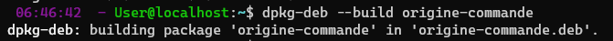

# **MOREL Loïc 3ICS**

## 1. Table des matières

- [1. Table des matières](#1-table-des-matières)
- [Exercice 1. Commandes de base](#exercice-1-commandes-de-base)
- [1. Commencez par mettre à jour votre système avec les commandes vues dans le cours.](#1-commencez-par-mettre-à-jour-votre-système-avec-les-commandes-vues-dans-le-cours)
- [2. Créez un alias “maj” de la ou des commande(s) de la question précédente. Où faut-il enregistrer cet alias pour qu’il ne soit pas perdu au prochain redémarrage ?](#2-créez-un-alias-maj-de-la-ou-des-commandes-de-la-question-précédente-où-faut-il-enregistrer-cet-alias-pour-quil-ne-soit-pas-perdu-au-prochain-redémarrage-)
- [3. Utilisez le fichier /var/log/dpkg.log pour obtenir les 5 derniers paquets installés sur votre machine.](#3-utilisez-le-fichier-varlogdpkglog-pour-obtenir-les-5-derniers-paquets-installés-sur-votre-machine)
- [4. Listez les derniers paquets qui ont été installés explicitement avec la commande apt install](#4-listez-les-derniers-paquets-qui-ont-été-installés-explicitement-avec-la-commande-apt-install)
- [5. Utilisez les commandes dpkg et apt pour compter de deux manières différentes le nombre de total de paquets installés sur la machine (ne pas hésiter à consulter le manuel !). Comment explique-t-on la (petite) différence de comptage ? Pourquoi ne peut-on pas utiliser directement le fichier dpkg.log ?](#5-utilisez-les-commandes-dpkg-et-apt-pour-compter-de-deux-manières-différentes-le-nombre-de-total-de-paquets-installés-sur-la-machine-ne-pas-hésiter-à-consulter-le-manuel--comment-explique-t-on-la-petite-différence-de-comptage--pourquoi-ne-peut-on-pas-utiliser-directement-le-fichier-dpkglog-)
      - [TODO](#todo)
- [6. Combien de paquets sont disponibles en téléchargement sur les dépôts Ubuntu ?](#6-combien-de-paquets-sont-disponibles-en-téléchargement-sur-les-dépôts-ubuntu-)
- [7. A quoi servent les paquets glances, tldr et hollywood ? Installez-les et testez-les.](#7-a-quoi-servent-les-paquets-glances-tldr-et-hollywood--installez-les-et-testez-les)
  - [Glances](#glances)
  - [tldr](#tldr)
  - [hollywood](#hollywood)
- [8. Quels paquets proposent de jouer au sudoku ? N’installez pas le paquet gnome-sudoku ou ksudoku sous peine de devoir probablement réinstaller votre VM](#8-quels-paquets-proposent-de-jouer-au-sudoku--ninstallez-pas-le-paquet-gnome-sudoku-ou-ksudoku-sous-peine-de-devoir-probablement-réinstaller-votre-vm)
- [Exercice 2. A partir de quel paquet est installée la commande ls ? Comment obtenir cette information en une seule commande, pour n’importe quel programme ?](#exercice-2-a-partir-de-quel-paquet-est-installée-la-commande-ls--comment-obtenir-cette-information-en-une-seule-commande-pour-nimporte-quel-programme-)
  - [Utilisez la réponse à cette question pour écrire un script appelé origine-commande (sans l’extension .sh) prenant en argument le nom d’une commande, et indiquant quel paquet l’a installée.](#utilisez-la-réponse-à-cette-question-pour-écrire-un-script-appelé-origine-commande-sans-lextension-sh-prenant-en-argument-le-nom-dune-commande-et-indiquant-quel-paquet-la-installée)
- [Exercice 3. Ecrire une commande qui affiche “INSTALLÉ” ou “NON INSTALLÉ” selon le nom et le statut du package spécifié dans cette commande.](#exercice-3-ecrire-une-commande-qui-affiche-installé-ou-non-installé-selon-le-nom-et-le-statut-du-package-spécifié-dans-cette-commande)
- [Exercice 4. Lister les programmes livrés avec coreutils. En particulier, on remarque que l’un deux se nomme [. De quoi s’agit-il ?](#exercice-4-lister-les-programmes-livrés-avec-coreutils-en-particulier-on-remarque-que-lun-deux-se-nomme--de-quoi-sagit-il-)
- [Exercice 5. aptitude Installez les paquets emacs et lynx à l’aide de la version graphique d’aptitude (et prenez deux minutes pour vous renseigner et tester ces paquets).](#exercice-5-aptitude-installez-les-paquets-emacs-et-lynx-à-laide-de-la-version-graphique-daptitude-et-prenez-deux-minutes-pour-vous-renseigner-et-tester-ces-paquets)
- [Exercice 6. Installation d’un paquet par PPA](#exercice-6-installation-dun-paquet-par-ppa)
- [Exercice 7. Installation d’un logiciel à partir du code source](#exercice-7-installation-dun-logiciel-à-partir-du-code-source)

## Exercice 1. Commandes de base

### 1. Commencez par mettre à jour votre système avec les commandes vues dans le cours

```console
User@localhost:~$ sudo apt update
User@localhost:~$ sudo apt upgrade
```

### 2. Créez un alias “maj” de la ou des commande(s) de la question précédente. Où faut-il enregistrer cet alias pour qu’il ne soit pas perdu au prochain redémarrage ?

Pour garder l'alias il faut l'inscrire dans le .bashrc

`alias maj='sudo apt update && sudo apt upgrade'`

Ensuite il faut recharger le fichier .bashrc

```Console
User@localhost:~$ source .bashrc
```

### 3. Utilisez le fichier /var/log/dpkg.log pour obtenir les 5 derniers paquets installés sur votre machine

`grep "installed" /var/log/dpkg.log | tail -n5`

```Text
2022-09-26 06:16:52 status installed python3-distutils:all 3.10.6-1~22.04
2022-09-26 06:16:52 status installed python3-gdbm:amd64 3.10.6-1~22.04
2022-09-26 06:16:52 status installed man-db:amd64 2.10.2-1
2022-09-26 06:16:52 status installed install-info:amd64 6.8-4build1
2022-09-26 06:16:52 status installed libc-bin:amd64 2.35-0ubuntu3.1
```

### 4. Listez les derniers paquets qui ont été installés explicitement avec la commande apt install

```Console
User@localhost:~$ grep "apt install" /var/log/apt/history.log
Commandline: apt install locate
Commandline: apt install unzip
Commandline: apt install zip
Commandline: apt install glances tldr hollywood
```

### 5. Utilisez les commandes dpkg et apt pour compter de deux manières différentes le nombre de total de paquets installés sur la machine (ne pas hésiter à consulter le manuel !). Comment explique-t-on la (petite) différence de comptage ? Pourquoi ne peut-on pas utiliser directement le fichier dpkg.log ?

```Console
User@localhost:~$ apt list --installed | wc -l
618
User@localhost:~$ dpkg --list | wc -l
625
```

#### TODO

### 6. Combien de paquets sont disponibles en téléchargement sur les dépôts Ubuntu ?

```Console
User@localhost:~$ apt list | wc -l
68953
```

### 7. A quoi servent les paquets glances, tldr et hollywood ? Installez-les et testez-les

```Console
User@localhost:~$ apt install glances tldr hollywood
68953
```

#### Glances

Glances est un utilitaire de supervision pour voir le cpu, mem, disk, network (alternative HTOP, btop)

#### tldr

Remplace la commande man en qui simplifie la documentation

#### hollywood

affichant des logs qui défilent, des lignes de commandes et du binaire façon Matrix pour faire des films avec des hacker

### 8. Quels paquets proposent de jouer au sudoku ? N’installez pas le paquet gnome-sudoku ou ksudoku sous peine de devoir probablement réinstaller votre VM

```Console
User@localhost:~$ apt list | grep sudoku
gnome-sudoku/jammy 1:42.0-1 amd64
ksudoku/jammy 4:21.12.3-0ubuntu1 amd64
sudoku-solver/jammy 1.0.1-3 amd64
sudoku/jammy 1.0.5-2build3 amd64
```

Les paquets gnome-sudoku, nudoku et ksudoku permettent de jouer au sudoku.

## Exercice 2. A partir de quel paquet est installée la commande ls ? Comment obtenir cette information en une seule commande, pour n’importe quel programme ?

```Console
User@localhost:~$ dpkg -S $(which -a ls)  2> /dev/null;
coreutils: /bin/ls
```

### Utilisez la réponse à cette question pour écrire un script appelé origine-commande (sans l’extension .sh) prenant en argument le nom d’une commande, et indiquant quel paquet l’a installée

```Bash
#!/bin/bash 

dpkg -S $(which -a $1)  2> /dev/null;
```

### Exercice 3. Ecrire une commande qui affiche “INSTALLÉ” ou “NON INSTALLÉ” selon le nom et le statut du package spécifié dans cette commande

`dpkg -s apt | grep Status && echo "INSTALLÉ" || echo "NON INSTALLÉ"`

### Exercice 4. Lister les programmes livrés avec coreutils. En particulier, on remarque que l’un deux se nomme [. De quoi s’agit-il ?

Pour lister les programmes qui ont été installés avec coreutils, on exécute la commande dpkg -L coreutils. Le programme nommé "[." est un le programme qui permet de faire des tests.

### Exercice 5. aptitude Installez les paquets emacs et lynx à l’aide de la version graphique d’aptitude (et prenez deux minutes pour vous renseigner et tester ces paquets)

```Console
User@localhost:~$ sudo apt-get update sudo apt-get install aptitude
```

`/` Selectionner le package a installer
Ctl + t Pour accetder au menu installation et installer le pakage.

Lynx : est un web-browser pour console
emacs : est un editer de text et d'afficher le résultat en temps réel

### Exercice 6. Installation d’un paquet par PPA

```Console
User@localhost:~$ sudo add-apt-repository ppa:linuxuprising/java && sudo apt update && sudo apt install oracle-java15-installer
```

Un nouveau fichier a bien été créé dans /etc/apt/sources.list.d/linuxuprising-ubuntu-java-jammy.list.
Il contient :

```Text
deb https://ppa.launchpadcontent.net/linuxuprising/java/ubuntu/ jammy main
# deb-src https://ppa.launchpadcontent.net/linuxuprising/java/ubuntu/ jammy main
```

### Exercice 7. Installation d’un logiciel à partir du code source

1. Commencez par cloner le dépôt git suivant :
2. Rendez vous dans le dossier
3. Malheureusement, cette installation “à la main” fait qu’on ne dispose pas des bénéfices de la gestion
de paquets apportés par dpkg ou apt. Heureusement, il est possible de transformer un logiciel installé
“à la main” en un paquet, et de le gérer ensuite avec apt ; c’est ce que permet par exemple l’outil
checkinstall
4. Recommencez la compilation à l’aide de checkinstall

```Console
User@localhost:~$ git clone https://gitlab.com/jallbrit/cbonsai.git
User@localhost:~$ cd cbonsai
User@localhost:~$ make install PREFIX=~/.local
User@localhost:~$ sudo make install
User@localhost:~$ sudo apt install checkinstall
User@localhost:~$ sudo checkinstall
```


### Exercice 8. Création de dépôt personnalisé

#### Création d’un paquet Debian avec dpkg-deb

1. Dans le dossier scripts créé lors du TP 2, créez un sous-dossier origine-commande où vous créerez un
sous-dossier DEBIAN, ainsi que l’arborescence usr/local/bin où vous placerez le script écrit à l’exercice 2

```Console
User@localhost:~$ mkdir origine-commande
User@localhost:~$ mkdir DEBIAN
User@localhost:~$ mkdir -p usr/local/bin
User@localhost:~$ cp ../origine-commande usr/local/bin
```

2. Dans le dossier DEBIAN, créez un fichier control avec les champs suivants :

```Text
Package: origine-commande
Version: 1.0
Section: base
Priority: optional
Architecture: all
Depends: coreutils
Maintainer: loic
Description: Affiche le paquet qui a installé une commande
```

3. Revenez dans le dossier parent de origine-commande (normalement, c’est votre $HOME) et tapez la commande suivante pour construire le paquet :

```Console
User@localhost:~$ dpkg-deb --build origine-commande
```

Resultat : origine-commande.deb


## Création du dépôt personnel avec reprepro

1. Dans votre dossier personnel, commencez par créer un dossier repo-cpe. Ce sera la racine de votre
dépôt

```Console
User@localhost:~$ mkdir repo-cpe
```

2. Ajoutez-y deux sous-dossiers : conf (qui contiendra la configuration du dépôt) et packages (qui contien-dra nos paquets)

```Console
User@localhost:~$ mkdir conf packages
```

3. Dans conf, créez le fichier distributions suivant :

```Console
User@localhost:~$ nano conf/distributions
```

```Text
Origin: Mon premier paquet
Label: Test repository
Suite: stable
Codename: jammy
Architectures: amd64
Components: multiverse
Description: Une description du paquet
```

4. Dans le dossier repo-cpe, générez l’arborescence du dépôt avec la commande reprepro -b . export

```Console
User@localhost:~$ sudo apt install reprepro
User@localhost:~$ reprepro -b . export
```

5. Copiez le paquet origine-commande.deb créé précédemment dans le dossier packages du dépôt, puis, à la racine du dépôt, exécutez la commande reprepro -b . includedeb cosmic origine-commande.deb afin que votre paquet soit inscrit dans le dépôt.

```Console
User@localhost:~$ cp ../origine-commande.deb packages
User@localhost:~$ reprepro -b . includedeb jammy packages/origine-commande.deb
Exporting indices...
```

6. Il faut à présent indiquer à apt qu’il existe un nouveau dépôt dans lequel il peut trouver des logiciels.
Pour cela, créez (avec sudo) dans le dossier /etc/apt/sources.list.d le fichier repo-cpe.list contenant : deb file:/home/VOTRE_NOM/repo-cpe cosmic multiverse

```Console
User@localhost:~$ sudo nano /etc/apt/sources.list.d/repo-cpe.list
```

```Text
deb file:/home/User/repo-cpe jammy multiverse
```

(cette ligne reprend la configuration du dépôt, elle est à adapter au besoin)
7. Lancez la commande sudo apt update.
  
```Console
User@localhost:~$ sudo apt update

Get:1 file:/home/User/repo-cpe cosmic InRelease
Ign:1 file:/home/User/repo-cpe cosmic InRelease
Get:2 file:/home/User/repo-cpe cosmic Release [969 B]
Get:2 file:/home/User/repo-cpe cosmic Release [969 B]
Get:3 file:/home/User/repo-cpe cosmic Release.gpg
Ign:3 file:/home/User/repo-cpe cosmic Release.gpg
Hit:4 https://ppa.launchpadcontent.net/linuxuprising/java/ubuntu jammy InRelease
Hit:5 http://us.archive.ubuntu.com/ubuntu jammy InRelease
Hit:6 http://us.archive.ubuntu.com/ubuntu jammy-updates InRelease
Hit:7 http://us.archive.ubuntu.com/ubuntu jammy-backports InRelease
Hit:8 http://us.archive.ubuntu.com/ubuntu jammy-security InRelease
Reading package lists... Done
N: Download is performed unsandboxed as root as file '/home/User/repo-cpe/dists/cosmic/InRelease' couldn't be accessed by user '_apt'. - pkgAcquire::Run (13: Permission denied)
E: The repository 'file:/home/User/repo-cpe cosmic Release' is not signed.
N: Updating from such a repository can't be done securely, and is therefore disabled by default.
N: See apt-secure(8) manpage for repository creation and user configuration details.
```

Féliciations ! Votre dépôt est désormais pris en compte ! ... Enfin, pas tout à fait... Si vous regardez
la sortie d’apt update, il est précidé que le dépôt ne peut être pris en compte car il n’est pas signé.
La signature permet de vérifier qu’un paquet provient biendu bon dépôt. On doit donc signer notre
dépôt.

## Signature du dépôt avec GPG

1. Commencez par créer une nouvelle paire de clés avec la commande
gpg --gen-key

```Console
User@localhost:~$ gpg --gen-key
```

Attention ! N’oubliez pas votre passphrase !!!
2. Ajoutez à la configuration du dépôt (fichier distributions la ligne suivante :
SignWith: yes

```Text
SignWith: yes
```

3. Ajoutez la clé à votre dépôt :
reprepro --ask-passphrase -b . export

```Console
User@localhost:~$ reprepro --ask-passphrase -b . export
```

Attention ! Cette méthode n’est pas sécurisée et obsolète ; dans un contexte professionnel, on utiliserait plutot un gpg-agent.
4. Ajoutez votre clé publique à votre dépôt avec la commande
gpg --export -a "auteur" > public.key

```Console
User@localhost:~$ gpg --export -a "loicm" > public.key
```

5. Enfin, ajoutez cette clé à la liste des clés fiables connues de apt :
sudo apt-key add public.key

```Console
User@localhost:~$ sudo apt-key add public.key
Warning: apt-key is deprecated. Manage keyring files in trusted.gpg.d instead (see apt-key(8)).
OK
```

Félicitations ! La configuration est (enfin) terminée ! Vérifiez que vous pouvez installer votre paquet comme n’importe quel autre paquet.
  
  ```Console
User@localhost:~$ sudo apt install origine-commande
Reading package lists... Done
Building dependency tree
Reading state information... Done
The following NEW packages will be installed:
  origine-commande
0 upgraded, 1 newly installed, 0 to remove and 0 not upgraded.
Need to get 0 B/1,024 B of archives.
After this operation, 4,096 B of additional disk space will be used.
Selecting previously unselected package origine-commande.
(Reading database ... 123456 files and directories currently installed.)
Preparing to unpack .../origine-commande.deb ...
Unpacking origine-commande (1.0) ...
Setting up origine-commande (1.0) ...
```